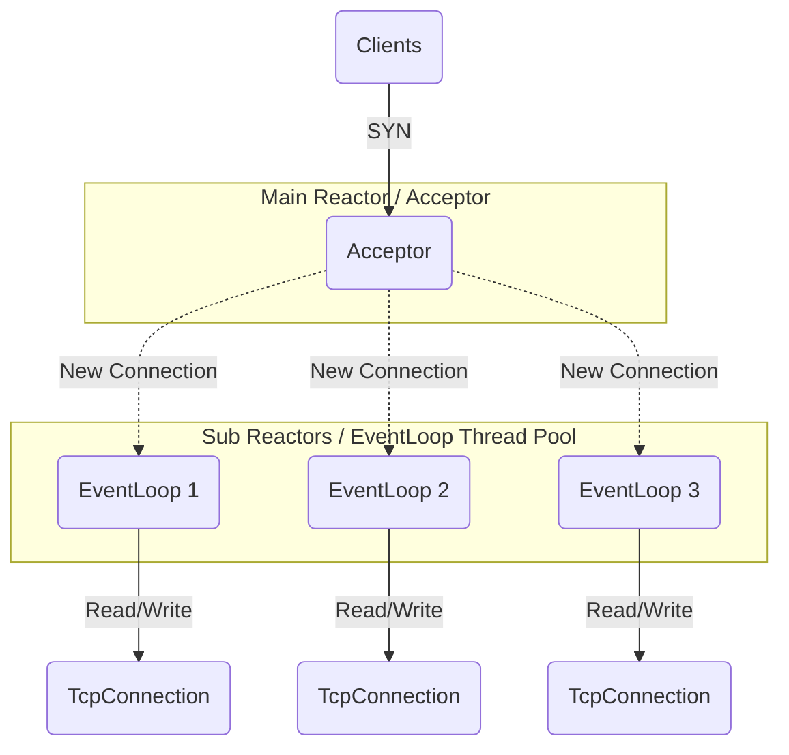

# Tiny-Muduo

  
  
  
  

> A high-performance non-blocking network library modeling after [Muduo](https://github.com/chenshuo/muduo), implemented in Modern C++11.

## 📖 Introduction

**Tiny-Muduo** is a reactor-pattern-based network library developed on Linux. It strips away the complex template magic of the original Muduo library and rewrites core components using **C++11 features** (smart pointers, lambda expressions, etc.), making the code cleaner and easier to understand.

**Tiny-Muduo** 是一个基于 Reactor 模式的高性能网络库。它去除了原版 Muduo 中复杂的 Boost 依赖，完全使用 C++11 重构。

## ✨ Key Features

- **Event Loop Model**: One Loop Per Thread + Non-blocking I/O + Epoll (Level Trigger).
- **Modern C++**: Heavy use of `std::shared_ptr`, `std::unique_ptr` for memory management.
- **Components**: Buffer, TimerQueue, AsyncLogging, TcpConnection.

## 🏗️ Architecture

Tiny-Muduo follows the **Multi-Reactors** pattern:

Build & Install
git clone https://github.com/zouzexu999/Tiny-Muduo.git
cd Tiny-Muduo
./autobuild.sh

Usage Example
Here is a simple Echo Server:
#include <mymuduo/TcpServer.h>
#include <mymuduo/Logger.h>
#include <string>

class EchoServer {
public:
    EchoServer(EventLoop *loop, const InetAddress &addr, const std::string &name)
        : server_(loop, addr, name), loop_(loop) {
        // Register callbacks
        server_.setConnectionCallback(std::bind(&EchoServer::onConnection, this, std::placeholders::_1));
        server_.setMessageCallback(std::bind(&EchoServer::onMessage, this, std::placeholders::_1, std::placeholders::_2, std::placeholders::_3));
        server_.setThreadNum(3); // Set thread pool size
    }
    
    void start() { server_.start(); }

private:
    void onConnection(const TcpConnectionPtr &conn) {
        if (conn->connected()) {
            LOG_INFO("Connection UP : %s", conn->peerAddress().toIpPort().c_str());
        } else {
            LOG_INFO("Connection DOWN : %s", conn->peerAddress().toIpPort().c_str());
        }
    }

    void onMessage(const TcpConnectionPtr &conn, Buffer *buf, Timestamp time) {
        std::string msg = buf->retrieveAllAsString();
        conn->send(msg); // Echo back
        conn->shutdown(); // Close connection
    }

    TcpServer server_;
    EventLoop *loop_;
};

int main() {
    EventLoop loop;
    InetAddress addr(8000);
    EchoServer server(&loop, addr, "EchoServer-01"); 
    server.start(); 
    loop.loop(); 
    return 0;
}
